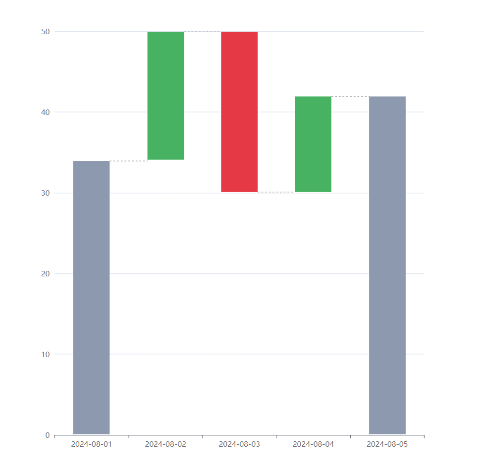

# echarts-waterfall

Third-party Waterfall extension for [Apache ECharts](https://github.com/apache/echarts).



## Install

```
yarn add echarts
yarn add @luxms/echarts-waterfall
```

## Example usage

```
import * as echarts from 'echarts';
import WaterfallChart from '@luxms/echarts-waterfall';

echarts.use(WaterfallChart);

const container = document.getElementById('main')
const chart = echarts.init(container);

chart.setOption({
  xAxis: {
    data: [
      "2024-08-01",
      "2024-08-02",
      "2024-08-03",
      "2024-08-04",
      "2024-08-05",
    ],
  },
  yAxis: {},
  series: {
    type: 'waterfall',
    data: [
      { value: [0, 34], isSubtotal: true },
      { value: [34, 50] },
      { value: [50, 30] },
      { value: [30, 42] },
      { value: [42, 0], isSubtotal: true },
    ],
  },
});
```

## Series options

Only chart-speciefic options are listed, but most of [common echarts options](https://echarts.apache.org/en/option.html) are working as well.

| Option                    | Type               | Defalut value | Note                            |
| ------------------------- | ------------------ | ------------- | ------------------------------- |
| `itemStyle`               | `Object`           |               | Bars common styles              |
| `itemStyle.colorPositive` | `string`           | `#47b262`     |                                 |
| `itemStyle.colorNegative` | `string`           | `#e63946`     |                                 |
| `itemStyle.colorSubtotal` | `string`           | `#8d99ae`     |                                 |
| `septum`                  | `Object`           |               | Bars connecting lines           |
| `septum.show`             | `boolean`          | `true`        |                                 |
| `data`                    | `Array<dataItem>`  |               |                                 |
| `dataItem`                | `Object`           |               |                                 |
| `dataItem.value`          | `[number, number]` |               | Start and end values of the bar |
| `dataItem.isSubtotal`     | `boolean`          | `false`       | If the bar is subtotal          |

## Note on local testing

Because `npm/yarn link` craetes symlink instead of copying files, it does not respect `.npmignore` file. That leads to non-obvious dependency conflict. Use [yalc](https://github.com/wclr/yalc) instead or see [other workarounds](https://github.com/npm/npm/issues/18987).
